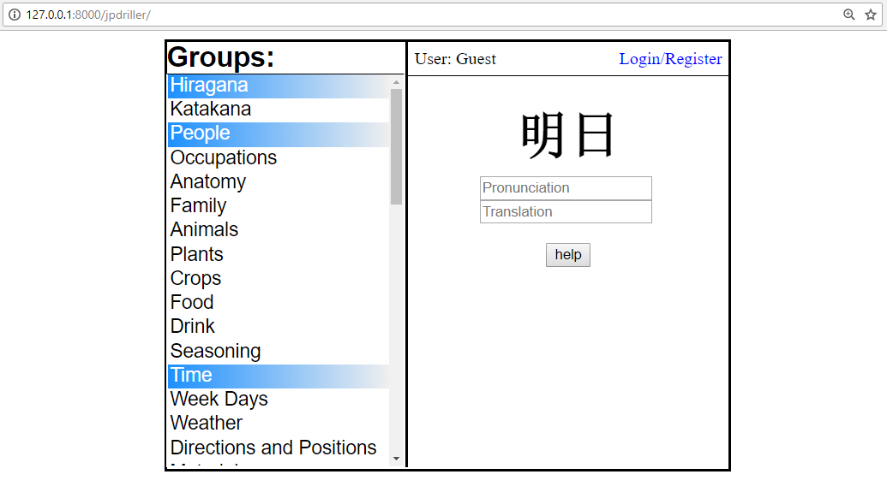

# jpdriller

Django app for drilling and memorizing Japanese through vocabulary.

To start, just run the batch file which runs the django server and opens a browser to localhost.

Server can run locally and site can be reached at http://127.0.0.1:8000/jpdriller/

Only requires python and django. 

Database is subject to change which means loss of registered user streaks.

Currently contains all hiragana and katakana as well as nearly 1,000 Japanese vocabulary, mainly kanji.

Read wiki for current main features.

Planning on publishing and hosting this app once I'm satisfied with the progress.
